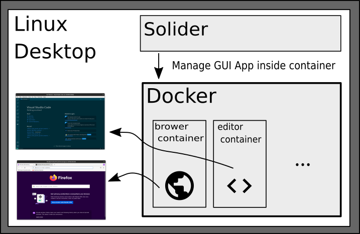

# Solider

Solider solidify Linux GUI applications.

## Description

This program allows you to run a variety of Linux GUI applications inside a Docker container.


## Requirement

- linux
- docker
- Your user has been added to the docker group.

## Install

```shell:shell
$ git clone https://github.com/ysuito/solider.git
$ cd solider
```

Set `solider/bin/` to your $PATH as desired.

## Usage

Copy directory containing app definition files from /template to /src. Then, build images. At last, launch selected app. In following example, we will launch firefox-solider, but you can choose any app you need from the /template to /src.

```shell:shell
$ cp -R template/ubuntubase src/
$ cp -R template/firefox-solider src/
$ ./bin/solider.py build_all
$ ./bin/solider.py start firefox-solider
```

The build-all method automatically registers the program in the launcher, so you can launch it by clicking on the icon on the desktop named as firefox-solider.

### Build All Image

`./bin/solider.py build-all`

### Build Specific Image

`./bin/solider.py build TARGET_NAME`

### Register as a Desktop Application

`./bin/solider.py entry`

### Show Available App List

`./bin/solider.py list`

### Start App

`./bin/solider.py start APP_NAME` or Click icon on the desktop.

### Release Unused Resources

`docker system prune`

### Log in to running Container

```shell:shell
$ docker ps
$ docker exec -it -u root CONTAINER_ID bash
```

## Template Apps

### Base Images

- ubuntubase

### Persistent Apps

- arduino-solider
- flutter-solider
- fritzing-solider
- gnumeric-solider
- kdenlive-solider
- meld-solider
- chrome-solider
- firefox-solider
- freecad-solider
- gimp-solider
- inkscape-solider
- keepassxc-solider
- qgis-solider
- vscode-solider

### Disposal Apps

- disp-browser-solider

## Custom Image

If you want to create a custom app, you will need the following.

```shell:shell
$ mkdir ./src/APP_NAME
$ cd ./src/APP_NAME
$ vim application.json
$ vim Dockerfile
$ vim APP_NAME.svg
```

Please refer to the other /template directories to create a definition file.

### About application.json

```json:application.json
{
  "CONTAINER_NAME": {
    "type": "disposal", // persistent, disposal
    "command": [
      "firefox-solider",  // container name
      "firefox", "--private-window", "--new-instance" // command
    ],
    "template": false, // build image
    "privileged": false, // Grant permissions. For example, when using a USB device.
    "path": [["host_path","container_path"]] // additional bind path
  }
}
```

#### type

- persistent: Home directory is bound to the host under /volume. Therefore, user data will be persistent.
- disposal: When the container is terminated, all data will be lost.

#### template

- true: Build this app image.
- false: Don't build this app image.

## Licence

Copyright (c) 2021 Yuta Suito
Released under the MIT license
[MIT](https://opensource.org/licenses/mit-license.phpE)

## Author

[ysuito](https://github.com/ysuito)
